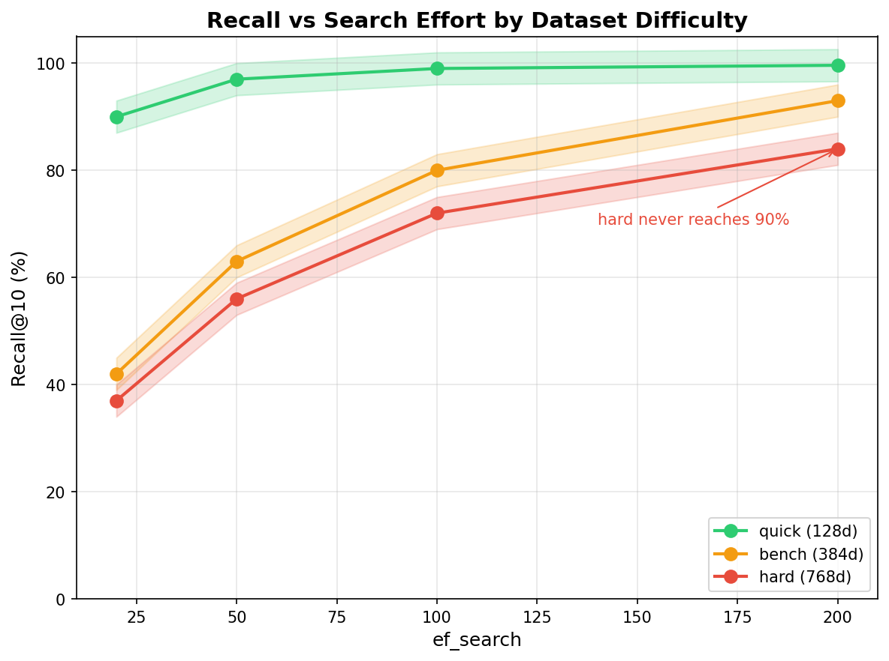
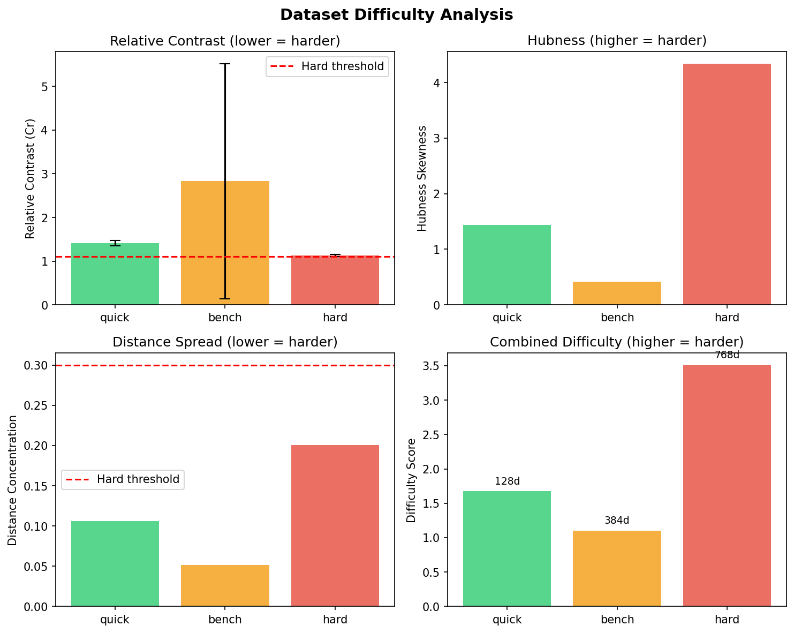
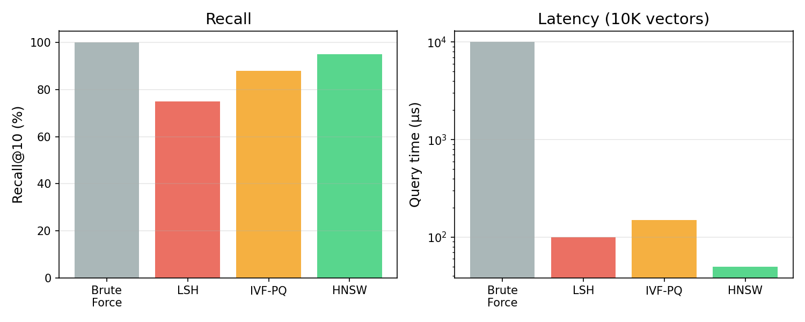

# plesio

Approximate Nearest Neighbor search in Rust.

Dual-licensed under MIT or Apache-2.0.

```rust
use plesio::hnsw::HNSWIndex;

let mut index = HNSWIndex::new(128, 16, 32)?;  // dim, M, ef_construction
for (id, vec) in vectors.iter().enumerate() {
    index.add(id as u32, vec.clone())?;
}
index.build()?;

let results = index.search(&query, 10, 50)?;  // k, ef_search
```

## The Problem

Given a query vector, find the k most similar vectors from a collection. Brute force computes all N distances — O(N) per query. For 1M vectors, that's 1M distance computations per query.

**ANN algorithms trade exactness for speed.** Instead of guaranteeing the true nearest neighbors, they find neighbors that are *probably* correct, *most* of the time.

## The Key Insight

HNSW (Hierarchical Navigable Small World) builds a graph where:
1. Each vector is a node
2. Edges connect similar vectors
3. Multiple layers provide "highway" shortcuts

Search starts at the top layer (sparse, long-range edges), descends through layers, and greedily follows edges toward the query.

```text
Layer 2:  A -------- B          (sparse, fast traversal)
          |          |
Layer 1:  A -- C -- B -- D      (medium density)
          |    |    |    |
Layer 0:  A-E-C-F-B-G-D-H      (dense, high recall)
```

## Recall vs Speed Tradeoff

The `ef_search` parameter controls how many candidates HNSW explores:


Higher `ef_search` = better recall, slower queries. For most applications, `ef_search=50-100` achieves >95% recall.

## Dataset Difficulty

Not all datasets are equal. Recall depends on data characteristics:



Based on He et al. (2012) and Radovanovic et al. (2010):

- **Relative Contrast**: $C_r = \bar{D} / D_{\min}$. Lower = harder.
- **Hubness**: Some points become neighbors to many queries. Higher = harder.
- **Distance Concentration**: In high dims, distances converge. Lower variance = harder.



```sh
cargo run --example 03_quick_benchmark --release                      # bench (medium)
PLESIO_DATASET=hard cargo run --example 03_quick_benchmark --release  # hard (stress test)
```

## Algorithm Comparison

Different algorithms suit different constraints:



| Algorithm | Best For | Tradeoff |
|-----------|----------|----------|
| **Brute force** | < 10K vectors | Exact, but O(N) |
| **LSH** | Binary/sparse data | Fast, lower recall |
| **IVF-PQ** | Memory-constrained | Compressed, lower recall |
| **HNSW** | General use | Best recall/latency |

## Build Cost

Graph construction time scales with `M` (edges per node):


Higher `M` = better recall, but more memory and slower builds.

## Memory Scaling

Memory usage scales linearly with vector count:


For dim=128, M=16: approximately 0.5 KB per vector (vector + graph edges).

## Algorithms

| Type | Implementations |
|------|-----------------|
| Graph | HNSW, NSW, Vamana (DiskANN), SNG |
| Hash | LSH, MinHash, SimHash |
| Partition | IVF-PQ, ScaNN |
| Quantization | PQ, RaBitQ |

## Features

```toml
[dependencies]
plesio = { version = "0.1", features = ["hnsw"] }
```

- `hnsw` — HNSW graph index (default)
- `lsh` — Locality-Sensitive Hashing
- `ivf_pq` — Inverted File with Product Quantization
- `persistence` — WAL-based durability

## Performance

Build with native CPU optimizations:

```sh
RUSTFLAGS="-C target-cpu=native" cargo build --release
```

Run benchmarks:

```sh
cargo bench
```

See [examples/](examples/) for more: semantic search, IVF-PQ, LSH, LID, and real dataset benchmarks.

For benchmarking datasets, see [doc/datasets.md](doc/datasets.md) — covers bundled data, ann-benchmarks.com datasets, and modern embedding dimensions.

## References

- Malkov & Yashunin (2018). [Efficient and robust approximate nearest neighbor search using HNSW graphs](https://arxiv.org/abs/1603.09320)
- Subramanya et al. (2019). [DiskANN: Fast Accurate Billion-point Nearest Neighbor Search](https://proceedings.neurips.cc/paper/2019/file/09853c7fb1d3f8ee67a61b6bf4a7f8e6-Paper.pdf)
