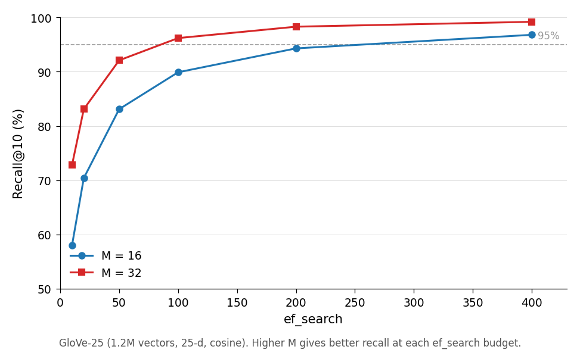
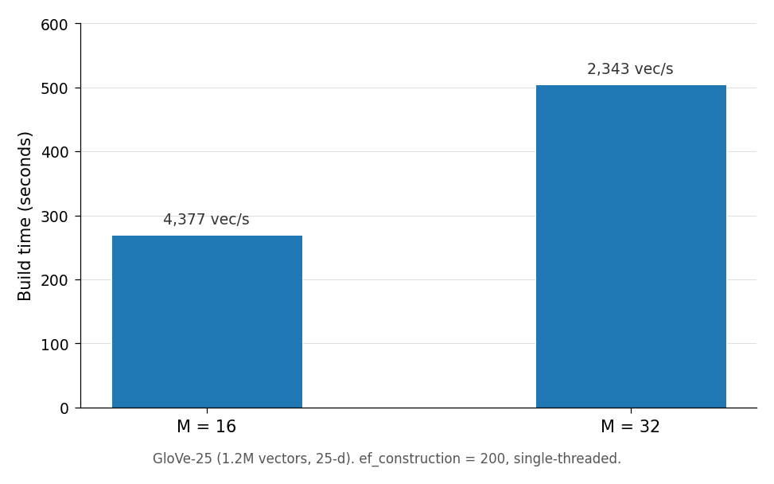
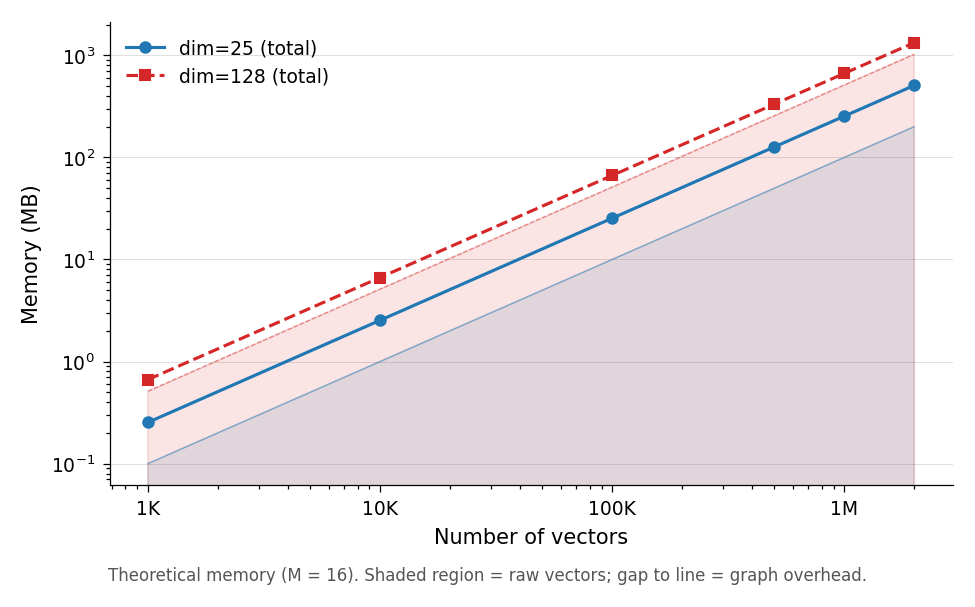

<p align="center">
  
</p>

# jin

Approximate nearest-neighbor (ANN) search in Rust.

## Minimal API

```rust
use jin::hnsw::HNSWIndex;

// 1. Create index (dim=4, M=16, ef_construction=32)
let mut index = HNSWIndex::new(4, 16, 32)?;

// 2. Add vectors
index.add_slice(0, &[1.0, 0.0, 0.0, 0.0])?;
index.add_slice(1, &[0.0, 1.0, 0.0, 0.0])?;

// 3. Build graph
index.build()?;

// 4. Search (k=1, ef_search=50)
let results = index.search(&[1.0, 0.0, 0.0, 0.0], 1, 50)?;
```

## The problem

Given a query vector, find the top-k most similar vectors from a collection.
Brute force computes all N distances (O(N) per query). For 1,000,000 vectors,
that's 1,000,000 distance computations per query.

ANN systems trade exactness for speed: they aim for **high recall** at much lower latency.

## The key idea (graph search, not magic)

HNSW builds a multi-layer graph where each point has:
- a few long edges (good for jumping across the space)
- and more local edges near the bottom (good for refinement)

A query does a greedy, coarse-to-fine walk:
- **start** from an entry point at the top layer
- **greedily descend** toward the query through progressively denser layers
- **maintain a candidate set** (size `ef_search`) at the bottom to avoid getting stuck

A more accurate mental model than “shortcuts” is:
**HNSW is a cheap way to keep multiple plausible local minima alive until you can locally refine.**

```text
Layer 2 (coarse):      o---------o
                        \       /
                         \  o  /
                          \ | /
Layer 1:          o---o---o-o---o---o
                    \      |      /
                     \     |     /
Layer 0 (dense):  o--o--o--o--o--o--o--o
                         ^
                 keep ~ef_search candidates here,
                 return the best k
```

## Tuning knobs (HNSW)

### `ef_search` (query effort)

In HNSW, `ef_search` controls how many candidates you keep during the bottom-layer search.
Larger values usually increase recall, at the cost of query time.

<p align="center">
  
</p>

Notes:
- This plot is from `jin`’s bundled “quick” profile (it’s meant to show the *shape* of the curve).
- It does **not** justify a universal claim like “ef_search=50–100 gives >95% recall” for all datasets.

Higher `ef_search` typically improves recall and increases query time. Start around `ef_search=50-100`
and measure recall@k vs latency for your dataset.

### `M` / graph degree (build-time and memory)

Higher `M` generally improves recall, but increases build time and memory.

<p align="center">
  
</p>

<p align="center">
  
</p>

Notes:
- These plots are for the labeled settings (e.g. 1K vectors for build-time; dim=128, M=16 for memory).
- Treat them as *sanity checks*, not as a stable performance contract.

## Distance semantics (current behavior)

Different components currently assume different distance semantics.
This is intentionally surfaced here because it's an easy place to make silent mistakes
(e.g. forgetting to normalize vectors).

| Component | Metric | Notes |
|---|---|---|
| `hnsw::HNSWIndex` | cosine distance | Fast path assumes **L2-normalized** vectors |
| `ivf_pq::IVFPQIndex` | cosine distance | Uses dot-based cosine distance for IVF + PQ |
| `scann::SCANNIndex` | inner product / cosine | Uses dot products; reranking uses cosine distance |
| `hnsw::dual_branch::DualBranchHNSW` | L2 distance | Experimental implementation |
| `quantization` | Hamming-like / binary distances | See `quantization::simd_ops::hamming_distance` and ternary helpers |

Planned direction: make distance semantics explicit via a shared metric/normalization contract
so that “same input vectors” means “same meaning” across indexes.

## Algorithms

| Type | Implementations |
|---|---|
| Graph | HNSW, NSW, Vamana (DiskANN), SNG |
| Partition | IVF-PQ, ScaNN |
| Quantization | PQ, RaBitQ |

## Features

```toml
[dependencies]
jin = { version = "0.1.0", features = ["hnsw"] }
```

- `hnsw` — HNSW graph index (default)
- `diskann` / `vamana` — DiskANN-style graph variants (experimental)
- `ivf_pq` — Inverted File with Product Quantization
- `scann` — ScaNN-style coarse-to-fine scaffolding (experimental)
- `quantization` / `rabitq` / `saq` — vector quantization and RaBitQ-style compression
- `persistence` — on-disk persistence helpers
- `python` — optional PyO3 bindings (feature-gated)

## Flat vs hierarchical graphs (why “H” may not matter)

HNSW’s hierarchy was designed to provide multi-scale “express lanes” for long-range navigation.
However, recent empirical work suggests that on **high-dimensional embedding datasets** a flat
navigable small-world graph can retain the key recall/latency benefits of HNSW, because “hub” nodes
emerge and already provide effective routing.

Concrete reference:
- Munyampirwa et al. (2024). *Down with the Hierarchy: The 'H' in HNSW Stands for "Hubs"* (arXiv:2412.01940).

Practical guidance in `jin`:
- Try `HNSW{m}` first (default; robust).
- If you want to experiment with a simpler flat graph, enable `nsw` and try `NSW{m}` via the factory.
  Benchmark recall@k vs latency on your workload; the “best” choice depends on data and constraints.

## Running benchmarks / examples

Benchmarks:

```sh
cargo bench
```

Example benchmark driver:

```sh
cargo run --example 03_quick_benchmark --release
JIN_DATASET=hard cargo run --example 03_quick_benchmark --release
```

See [examples/](examples/) for more: semantic search, IVF-PQ, LID, and real dataset benchmarks.

For primary sources (papers) backing the algorithms and phenomena mentioned in docs, see [doc/references.md](doc/references.md).

## References

- Malkov & Yashunin (2016/2018). *Efficient and robust approximate nearest neighbor search using HNSW graphs* (HNSW). `https://arxiv.org/abs/1603.09320`
- Malkov et al. (2014). *Approximate nearest neighbor algorithm based on navigable small world graphs* (NSW). `https://doi.org/10.1016/j.is.2013.10.006`
- Munyampirwa et al. (2024). *Down with the Hierarchy: The “H” in HNSW Stands for “Hubs”*. `https://arxiv.org/abs/2412.01940`
- Subramanya et al. (2019). *DiskANN: Fast Accurate Billion-point Nearest Neighbor Search on a Single Node*. `https://proceedings.neurips.cc/paper/2019/hash/09853c7fb1d3f8ee67a61b6bf4a7f8e6-Abstract.html`
- Jégou, Douze, Schmid (2011). *Product Quantization for Nearest Neighbor Search* (PQ / IVFADC). `https://ieeexplore.ieee.org/document/5432202`
- Ge et al. (2014). *Optimized Product Quantization* (OPQ). `https://arxiv.org/abs/1311.4055`
- Guo et al. (2020). *Accelerating Large-Scale Inference with Anisotropic Vector Quantization* (ScaNN line). `https://arxiv.org/abs/1908.10396`
