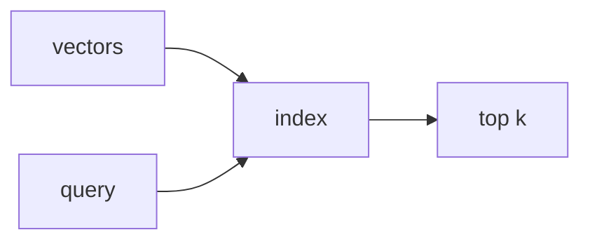

<p align="center"><b>vicinity</b></p>



Approximate Nearest Neighbor search in Rust.

Dual-licensed under MIT or Apache-2.0.

```rust
use vicinity::hnsw::HNSWIndex;

let mut index = HNSWIndex::new(128, 16, 16)?;  // dim, M, M_max

index.add(0, vec![0.1; 128])?;
index.add(1, vec![0.2; 128])?;
index.build()?;

let results = index.search(&query, 10, 50)?;  // k, ef
```

## Algorithms

| Type | Algorithms |
|------|------------|
| Graph | HNSW, NSW, Vamana (DiskANN), SNG |
| Hash | LSH, MinHash, SimHash |
| Partition | IVF-PQ, ScaNN |
| Quantization | PQ, RaBitQ |

## When to Use What

- **< 10K vectors**: Brute force (no index overhead)
- **Memory-constrained**: IVF-PQ, quantization
- **Disk-based**: Vamana/DiskANN
- **Default choice**: HNSW (best recall/latency tradeoff)

## Features

- `hnsw` — HNSW graph index (default)
- `lsh` — LSH, MinHash, SimHash
- `ivf_pq` — IVF with product quantization
- `persistence` — WAL-based durability

## Performance

Build with native CPU optimizations:

```bash
RUSTFLAGS="-C target-cpu=native" cargo build --release
```

Run benchmarks:

```bash
cargo bench
```
