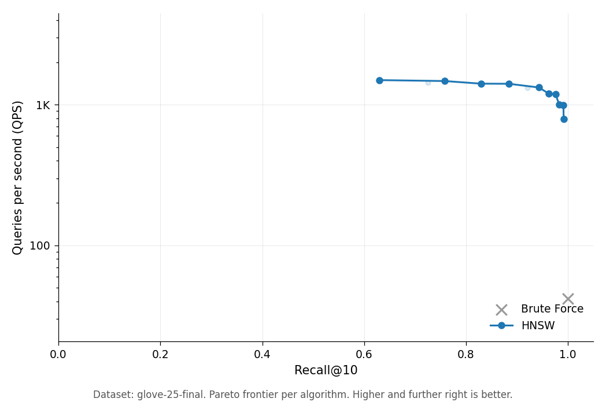

# vicinity

[](https://crates.io/crates/vicinity)
[](https://docs.rs/vicinity)
[](https://github.com/arclabs561/vicinity/actions/workflows/ci.yml)

Nearest-neighbor search.

```toml
[dependencies]
vicinity = { version = "0.2.0", features = ["hnsw"] }
```

## Minimal API

Builder pattern (recommended):

```rust
use vicinity::hnsw::{HNSWBuilder, HNSWIndex};

// 1. Create index via builder
let mut index = HNSWIndex::builder(128)
    .m(16)
    .ef_search(50)
    .auto_normalize(true)
    .build()?;

// 2. Add vectors (auto-normalized when auto_normalize=true)
index.add_slice(0, &vec![0.1; 128])?;
index.add_slice(1, &vec![0.2; 128])?;

// 3. Build graph
index.build()?;

// 4. Search (k=1, ef_search=50)
let results = index.search(&vec![0.1; 128], 1, 50)?;
```

Direct constructor (when you need explicit control over `m_max`):

```rust
use vicinity::hnsw::HNSWIndex;

let mut index = HNSWIndex::new(4, 16, 16)?;
index.add_slice(0, &[1.0, 0.0, 0.0, 0.0])?;
index.add_slice(1, &[0.0, 1.0, 0.0, 0.0])?;
index.build()?;
let results = index.search(&[1.0, 0.0, 0.0, 0.0], 1, 50)?;
```

## The problem

Given a query vector, find the top-k most similar vectors from a collection.
Brute force computes all N distances (O(N) per query). For 1,000,000 vectors,
that's 1,000,000 distance computations per query.

ANN systems trade exactness for speed: they aim for high recall at much lower latency.

## The key idea (graph search, not magic)

HNSW builds a multi-layer graph where each point has:
- a few long edges (good for jumping across the space)
- and more local edges near the bottom (good for refinement)

A query does a greedy, coarse-to-fine walk:
- **start** from an entry point at the top layer
- **greedily descend** toward the query through progressively denser layers
- **maintain a candidate set** (size `ef_search`) at the bottom to avoid getting stuck

A more accurate mental model than “shortcuts” is:
**HNSW is a cheap way to keep multiple plausible local minima alive until you can locally refine.**

```text
Layer 2 (coarse):      o---------o
                        \       /
                         \  o  /
                          \ | /
Layer 1:          o---o---o-o---o---o
                    \      |      /
                     \     |     /
Layer 0 (dense):  o--o--o--o--o--o--o--o
                         ^
                 keep ~ef_search candidates here,
                 return the best k
```

## Tuning knobs (HNSW)

### Recall vs throughput

<p align="center">
  
</p>

HNSW (M=16, m_max=32) achieves 63-99% recall@10 at 800-1500 QPS on GloVe-25 (1.18M vectors, 25-d, cosine). Brute force provides the recall=1.0 baseline at ~42 QPS. See `doc/benchmark-results.md` for full numbers.

### `ef_search` (query effort)

`ef_search` controls how many candidates are explored during search. Larger values increase recall at the cost of query time. Start around `ef_search=50-100` and measure recall@k vs latency for your dataset.

Higher `ef_search` typically improves recall and increases query time. Start around `ef_search=50-100`
and measure recall@k vs latency for your dataset.

### `M` / graph degree (build-time and memory)

Higher `M` generally improves recall, but increases build time and memory.

Build time on GloVe-25 (1.2M vectors, 25d, single-threaded, `ef_construction=200`):

| M | Build time | Throughput |
|---|---|---|
| 16 | ~270s | 4,377 vec/s |
| 32 | ~505s | 2,343 vec/s |

<p align="center">
  
</p>

Notes:
- Memory plot is theoretical (formula: `N*D*4 + N*M*2*4*1.2`).
- Treat these as reference points, not a stable performance contract.

## Distance semantics

HNSW assumes L2-normalized vectors for cosine distance (the fast path). IVF-PQ and ScaNN also use cosine-family distances. See the [API docs](https://docs.rs/vicinity) for per-index details.

## Algorithms

Stable: HNSW, NSW, IVF-PQ, PQ, RaBitQ, SQ8. Experimental: Vamana (DiskANN), SNG, DEG, ScaNN, KD-Tree, Ball Tree, RP-Forest, K-Means Tree. Each is behind its own feature flag.

## Features

The default feature is `hnsw`. Additional features: `nsw`, `ivf_pq`, `scann`, `diskann`/`vamana`, `quantization`/`rabitq`/`saq`, `serde` (save/load), `parallel` (rayon batch search), `persistence` (on-disk WAL), `experimental`, `python` (PyO3 bindings). Compiles on `wasm32-unknown-unknown` with default features. See [docs.rs](https://docs.rs/vicinity) for the full feature list.

## Running benchmarks / examples

Quick benchmark (generates synthetic data if no pre-built files exist):

```sh
cargo run --example 03_quick_benchmark --release
```

With real ann-benchmarks datasets:

```sh
# Download and convert (requires Python + h5py)
uv run scripts/download_ann_benchmarks.py sift-128-euclidean

# List available datasets
uv run scripts/download_ann_benchmarks.py --list
```

Criterion microbenchmarks:

```sh
cargo bench
```

### Examples

Key examples: `01_basic_search`, `02_measure_recall`, `03_quick_benchmark`, `semantic_search_demo`, `ivf_pq_demo`, `rabitq_demo`. See `examples/` for the full set (~20 examples covering benchmarks, quantization, hybrid search, and WASM).

## References

- Malkov & Yashunin (2016/2018). *Efficient and robust approximate nearest neighbor search using HNSW graphs* (HNSW). `https://arxiv.org/abs/1603.09320`
- Malkov et al. (2014). *Approximate nearest neighbor algorithm based on navigable small world graphs* (NSW). `https://doi.org/10.1016/j.is.2013.10.006`
- Munyampirwa et al. (2024). *Down with the Hierarchy: The “H” in HNSW Stands for “Hubs”*. `https://arxiv.org/abs/2412.01940`
- Subramanya et al. (2019). *DiskANN: Fast Accurate Billion-point Nearest Neighbor Search on a Single Node*. `https://proceedings.neurips.cc/paper/2019/hash/09853c7fb1d3f8ee67a61b6bf4a7f8e6-Abstract.html`
- Jégou, Douze, Schmid (2011). *Product Quantization for Nearest Neighbor Search* (PQ / IVFADC). `https://ieeexplore.ieee.org/document/5432202`
- Ge et al. (2014). *Optimized Product Quantization* (OPQ). `https://arxiv.org/abs/1311.4055`
- Guo et al. (2020). *Accelerating Large-Scale Inference with Anisotropic Vector Quantization* (ScaNN line). `https://arxiv.org/abs/1908.10396`
- Gao & Long (2024). *RaBitQ: Quantizing High-Dimensional Vectors with a Theoretical Error Bound for Approximate Nearest Neighbor Search*. `https://arxiv.org/abs/2405.12497`

## License

MIT OR Apache-2.0
