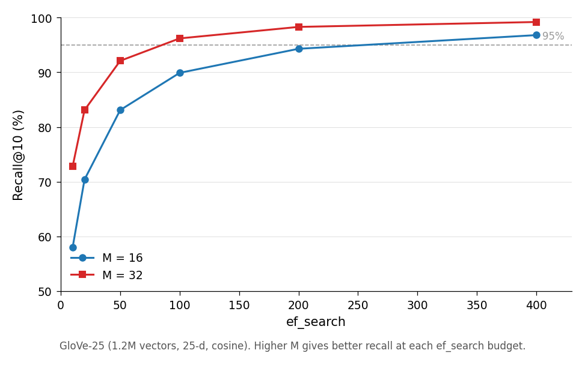
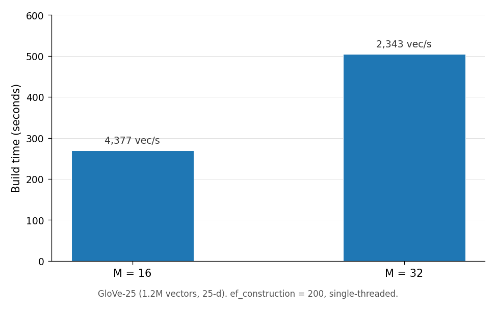
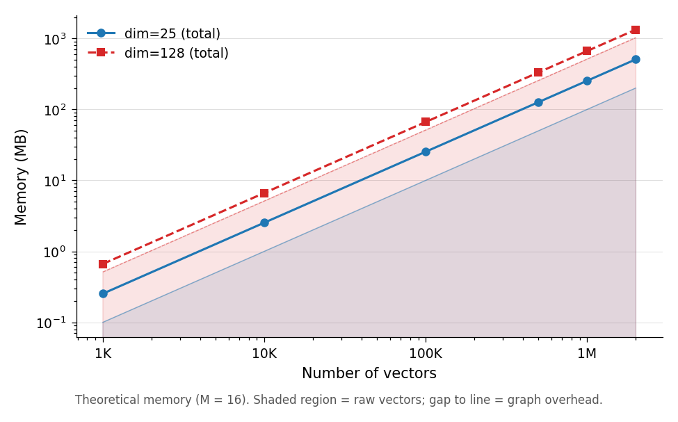

# vicinity

[](https://crates.io/crates/vicinity)
[](https://docs.rs/vicinity)
[](https://github.com/arclabs561/vicinity/actions/workflows/ci.yml)

Approximate nearest-neighbor (ANN) search in Rust. HNSW, NSW, DiskANN, IVF-PQ, ScaNN, PQ, and RaBitQ -- pure Rust, no C/C++ bindings.

```toml
[dependencies]
vicinity = { version = "0.2.0", features = ["hnsw"] }
```

## Minimal API

Builder pattern (recommended):

```rust
use vicinity::hnsw::{HNSWBuilder, HNSWIndex};

// 1. Create index via builder
let mut index = HNSWIndex::builder(128)
    .m(16)
    .ef_search(50)
    .auto_normalize(true)
    .build()?;

// 2. Add vectors (auto-normalized when auto_normalize=true)
index.add_slice(0, &vec![0.1; 128])?;
index.add_slice(1, &vec![0.2; 128])?;

// 3. Build graph
index.build()?;

// 4. Search (k=1, ef_search=50)
let results = index.search(&vec![0.1; 128], 1, 50)?;
```

Direct constructor (when you need explicit control over `m_max`):

```rust
use vicinity::hnsw::HNSWIndex;

let mut index = HNSWIndex::new(4, 16, 16)?;
index.add_slice(0, &[1.0, 0.0, 0.0, 0.0])?;
index.add_slice(1, &[0.0, 1.0, 0.0, 0.0])?;
index.build()?;
let results = index.search(&[1.0, 0.0, 0.0, 0.0], 1, 50)?;
```

## The problem

Given a query vector, find the top-k most similar vectors from a collection.
Brute force computes all N distances (O(N) per query). For 1,000,000 vectors,
that's 1,000,000 distance computations per query.

ANN systems trade exactness for speed: they aim for **high recall** at much lower latency.

## The key idea (graph search, not magic)

HNSW builds a multi-layer graph where each point has:
- a few long edges (good for jumping across the space)
- and more local edges near the bottom (good for refinement)

A query does a greedy, coarse-to-fine walk:
- **start** from an entry point at the top layer
- **greedily descend** toward the query through progressively denser layers
- **maintain a candidate set** (size `ef_search`) at the bottom to avoid getting stuck

A more accurate mental model than “shortcuts” is:
**HNSW is a cheap way to keep multiple plausible local minima alive until you can locally refine.**

```text
Layer 2 (coarse):      o---------o
                        \       /
                         \  o  /
                          \ | /
Layer 1:          o---o---o-o---o---o
                    \      |      /
                     \     |     /
Layer 0 (dense):  o--o--o--o--o--o--o--o
                         ^
                 keep ~ef_search candidates here,
                 return the best k
```

## Tuning knobs (HNSW)

### `ef_search` (query effort)

In HNSW, `ef_search` controls how many candidates you keep during the bottom-layer search.
Larger values usually increase recall, at the cost of query time.

<p align="center">
  
</p>

Notes:
- Data from GloVe-25 (1.2M vectors, 25-d, cosine). See `doc/benchmark-results.md` for full numbers.
- Results are dataset-specific; do **not** assume these recall values generalize to other distributions.

Higher `ef_search` typically improves recall and increases query time. Start around `ef_search=50-100`
and measure recall@k vs latency for your dataset.

### `M` / graph degree (build-time and memory)

Higher `M` generally improves recall, but increases build time and memory.

<p align="center">
  
</p>

<p align="center">
  
</p>

Notes:
- Build-time data from GloVe-25 (1.2M vectors). Memory plot is theoretical (formula: N*D*4 + N*M*2*4*1.2).
- Treat these as reference points, not a stable performance contract.

## Distance semantics (current behavior)

Different components currently assume different distance semantics.
This is intentionally surfaced here because it's an easy place to make silent mistakes
(e.g. forgetting to normalize vectors).

| Component | Metric | Notes |
|---|---|---|
| `hnsw::HNSWIndex` | cosine distance | Fast path assumes **L2-normalized** vectors |
| `ivf_pq::IVFPQIndex` | cosine distance | Uses dot-based cosine distance for IVF + PQ |
| `scann::SCANNIndex` | dot (coarse) / cosine (rerank) | Dot product for partition scoring, cosine distance for reranking |
| `hnsw::dual_branch::DualBranchHNSW` | L2 distance | Experimental implementation |
| `quantization` | Hamming-like / binary distances | See `quantization::simd_ops::hamming_distance` and ternary helpers |

Planned direction: make distance semantics explicit via a shared metric/normalization contract
so that “same input vectors” means “same meaning” across indexes.

## Algorithms

| Type | Implementations | Status |
|---|---|---|
| Graph | HNSW, NSW | Stable |
| Graph | Vamana (DiskANN), SNG, DEG | Experimental |
| Partition | IVF-PQ | Stable |
| Partition | ScaNN | Experimental |
| Quantization | PQ, RaBitQ, SQ8 (scalar) | Stable |
| Tree | KD-Tree, Ball Tree, RP-Forest, K-Means Tree | Experimental |

## Beyond basic search

| Capability | API | Notes |
|---|---|---|
| **Batch add** | `index.add_batch(ids, vectors)` | Bulk ingestion from flat f32 slice |
| **Delete vectors** | `index.delete(doc_id)` | Lazy tombstoning; deleted vectors excluded from results |
| **Filtered search** | `index.search_with_filter(query, k, ef, predicate)` | ACORN-style metadata filtering during graph traversal |
| **Save / load** | `index.save_to_writer(w)` / `HNSWIndex::load_from_reader(r)` | Requires `serde` feature |
| **Batch search** | `index.search_batch(&queries, k, ef)` | Parallel via rayon; requires `parallel` feature |
| **Scalar quantization** | `ScalarQuantizedHNSW::new(dim, m, m_max)` | ~4x memory reduction (uint8); asymmetric search + optional reranking |
| **Streaming updates** | `StreamingCoordinator::new(index, config)` | Buffer-and-compact architecture for online insert/delete |

## Features

```toml
[dependencies]
vicinity = { version = "0.2.0", features = ["hnsw"] }
```

- `hnsw` — HNSW graph index (default, with `innr` SIMD)
- `innr` — Pure Rust SIMD distance kernels (default; alternative: `simsimd` for C-based SIMD)
- `simsimd` — SimSIMD C bindings for distance computation (replaces `innr` when enabled)
- `serde` — JSON serialization for index save/load (`save_to_writer` / `load_from_reader`)
- `parallel` — Rayon-based batch search (`search_batch`, `search_batch_flat`)
- `nsw` — Flat navigable small-world graph (alternative to HNSW, no hierarchy)
- `sng` — OPT-SNG auto-tuned sparse neighborhood graph (experimental)
- `diskann` / `vamana` — DiskANN-style graph variants (experimental)
- `ivf_pq` — Inverted File with Product Quantization (activates `clump` for k-means clustering)
- `scann` — ScaNN-style coarse-to-fine scaffolding (experimental; activates `clump`)
- `evoc` — EVoC hierarchical clustering (activates `clump`)
- `quantization` / `rabitq` / `saq` — vector quantization and RaBitQ-style compression
- `persistence` — segment-based on-disk persistence with WAL and crash recovery (requires `durability`)
- `python` — optional PyO3 bindings (feature-gated)

Compiles on `wasm32-unknown-unknown` with default features.

## Flat vs hierarchical graphs (why “H” may not matter)

HNSW’s hierarchy was designed to provide multi-scale “express lanes” for long-range navigation.
However, recent empirical work suggests that on **high-dimensional embedding datasets** a flat
navigable small-world graph can retain the key recall/latency benefits of HNSW, because “hub” nodes
emerge and already provide effective routing.

Concrete reference:
- Munyampirwa et al. (2024). *Down with the Hierarchy: The 'H' in HNSW Stands for "Hubs"* (arXiv:2412.01940).

Practical guidance in `vicinity`:
- Try `HNSW{m}` first (default; well-tested).
- If you want to experiment with a simpler flat graph, enable `nsw` and try `NSW{m}` via the factory.
  Benchmark recall@k vs latency on your workload; the “best” choice depends on data and constraints.

## Running benchmarks / examples

Quick benchmark (generates synthetic data if no pre-built files exist):

```sh
cargo run --example 03_quick_benchmark --release
```

With real ann-benchmarks datasets:

```sh
# Download and convert (requires Python + h5py)
uv run scripts/download_ann_benchmarks.py sift-128-euclidean

# List available datasets
uv run scripts/download_ann_benchmarks.py --list
```

Criterion microbenchmarks:

```sh
cargo bench
```

### Examples quick reference

| Example | Features | What it demonstrates |
|---|---|---|
| `01_basic_search` | `hnsw` (default) | Minimal build-and-search workflow |
| `02_measure_recall` | `hnsw` (default) | Recall@k measurement against brute force |
| `03_quick_benchmark` | `hnsw` (default) | Benchmark with synthetic or bundled data (no downloads) |
| `04_rigorous_benchmark` | `hnsw` (default) | Multi-run benchmark with confidence intervals |
| `05_normalization_matters` | `hnsw` (default) | Why L2-normalization is required for HNSW cosine search |
| `hnsw_benchmark` | `hnsw` (default) | HNSW vs brute-force speed and recall |
| `semantic_search_demo` | `hnsw` (default) | End-to-end semantic search pipeline |
| `ivf_pq_demo` | `ivf_pq` | IVF-PQ index construction and querying |
| `rabitq_demo` | `rabitq`, `hnsw`, `quantization` | RaBitQ binary quantization |
| `evoc_demo` | `evoc` | EVoC hierarchical clustering |
| `lid_demo` | `hnsw` (default) | LID estimation on synthetic data |
| `lid_outlier_detection` | `hnsw` (default) | LID-based anomaly detection |
| `dual_branch_demo` | `hnsw` (default) | LID-driven dual-branch HNSW |
| `dual_branch_hnsw_demo` | `hnsw` (default) | LID-aware graph construction |
| `sift_benchmark` | `hnsw` | Synthetic 50K benchmark (SIFT-like) |
| `glove_benchmark` | `hnsw` (default) | GloVe-25 real dataset benchmark |
| `retrieve_and_rerank` | `hnsw` | Two-stage retrieval with reranking |
| `ann_benchmark` | `hnsw` | ann-benchmarks runner (real datasets, HNSW + NSW) |
| `hybrid_search` | `hnsw` | Combined vector + metadata search |
| `wasm_search` | `hnsw` | WebAssembly-compatible search |
| `embedding_pipeline` | `hnsw` | End-to-end embedding ingestion pipeline |

For primary sources (papers) backing the algorithms and phenomena mentioned in docs, see [doc/references.md](doc/references.md).

## References

- Malkov & Yashunin (2016/2018). *Efficient and robust approximate nearest neighbor search using HNSW graphs* (HNSW). `https://arxiv.org/abs/1603.09320`
- Malkov et al. (2014). *Approximate nearest neighbor algorithm based on navigable small world graphs* (NSW). `https://doi.org/10.1016/j.is.2013.10.006`
- Munyampirwa et al. (2024). *Down with the Hierarchy: The “H” in HNSW Stands for “Hubs”*. `https://arxiv.org/abs/2412.01940`
- Subramanya et al. (2019). *DiskANN: Fast Accurate Billion-point Nearest Neighbor Search on a Single Node*. `https://proceedings.neurips.cc/paper/2019/hash/09853c7fb1d3f8ee67a61b6bf4a7f8e6-Abstract.html`
- Jégou, Douze, Schmid (2011). *Product Quantization for Nearest Neighbor Search* (PQ / IVFADC). `https://ieeexplore.ieee.org/document/5432202`
- Ge et al. (2014). *Optimized Product Quantization* (OPQ). `https://arxiv.org/abs/1311.4055`
- Guo et al. (2020). *Accelerating Large-Scale Inference with Anisotropic Vector Quantization* (ScaNN line). `https://arxiv.org/abs/1908.10396`
- Gao & Long (2024). *RaBitQ: Quantizing High-Dimensional Vectors with a Theoretical Error Bound for Approximate Nearest Neighbor Search*. `https://arxiv.org/abs/2405.12497`

## See also

- [`innr`](https://crates.io/crates/innr) -- SIMD-accelerated similarity kernels (direct dependency for distance computation)

## License

MIT OR Apache-2.0
